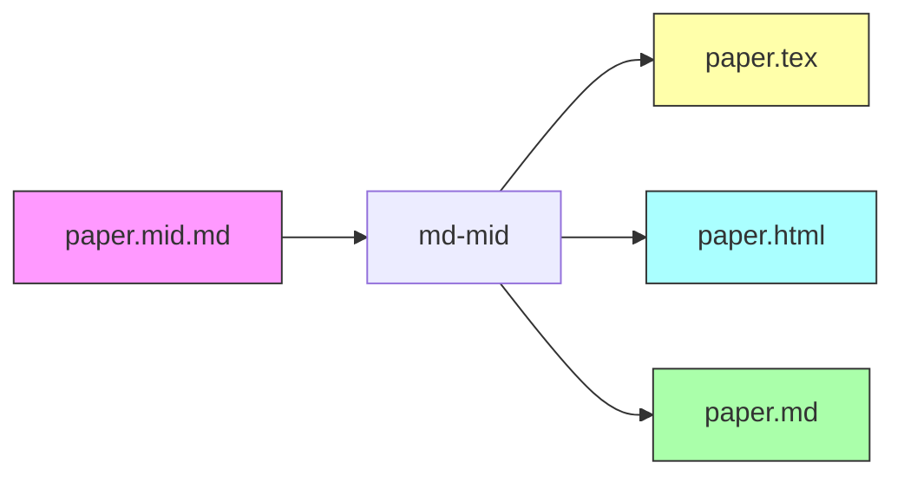
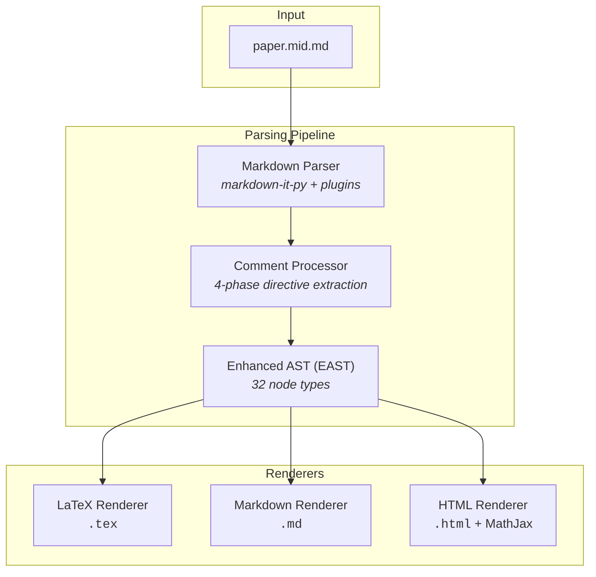
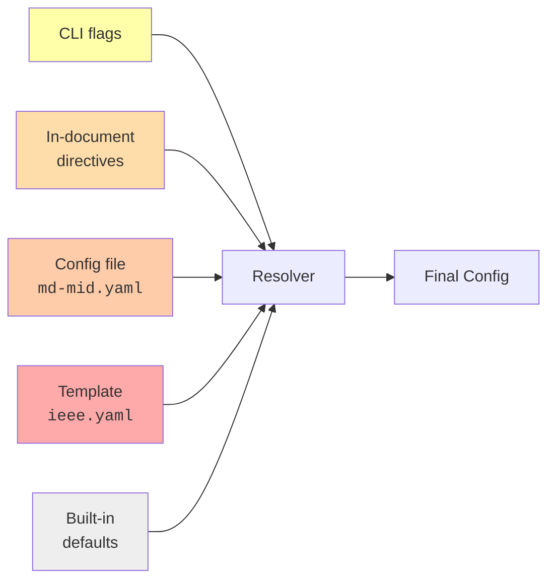
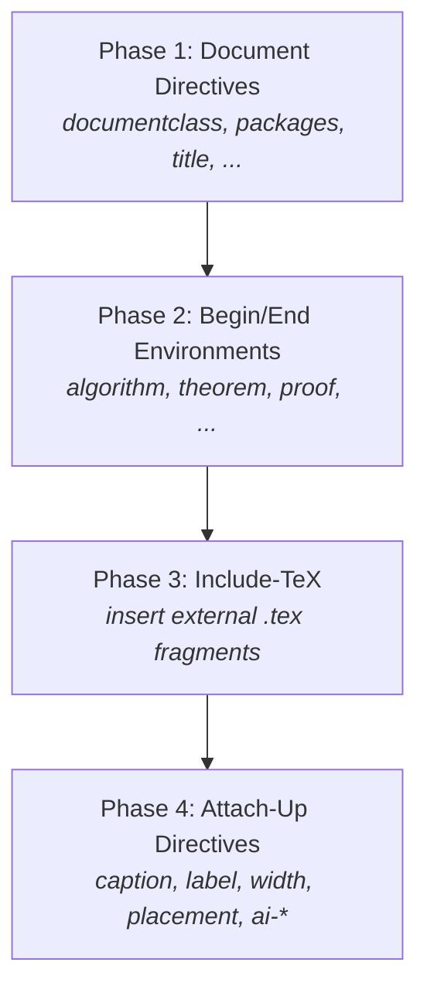

# md-mid

[](https://www.python.org/)
[](LICENSE)
[](tests/)
[](https://mypy-lang.org/)
[](https://docs.astral.sh/ruff/)
[](https://docs.astral.sh/uv/)

**[中文文档](README_ZH.md)** · English

---

**Academic Writing Intermediate Format & Multi-target Conversion Tool**

md-mid defines a Markdown-based intermediate format (`.mid.md`) for academic writing.
Write your paper once in plain Markdown with metadata encoded in HTML comments, then
convert to **LaTeX**, **rich Markdown**, or **self-contained HTML** — all from a single
source file.



## Features

- **Multi-target output** — LaTeX (`.tex`), rich Markdown (`.md`), and HTML with MathJax
- **8 citation commands** — `cite`, `citep`, `citet`, `citeauthor`, `citeyear`, `textcite`,
  `parencite`, `autocite` with BibTeX file parsing
- **Math** — inline `$...$` and display `$$...$$` with labels and equation environments
- **Cross-references** — labels and refs that become `\ref{}` / `<a href>` / `{#id}` per target
- **Figures & tables** — caption, label, width, placement via HTML comment directives
- **Environments** — `<!-- begin: algorithm -->` / `<!-- end: algorithm -->` blocks
- **Include TeX** — `<!-- include-tex: fragment.tex -->` for external LaTeX fragments
- **AI figure generation** — optional pipeline with nanobanana-compatible runners
- **5-layer config** — CLI > directives > config file > template > defaults
- **i18n** — `zh` (中文) and `en` locale support for figure/table labels

## Architecture



Each renderer supports three output modes:

| Mode | LaTeX | Markdown | HTML |
|------|-------|----------|------|
| `full` | Preamble + `\begin{document}` + bibliography | YAML front matter + body + footnotes | `<!DOCTYPE html>` + CSS + MathJax CDN |
| `body` | Content inside `\begin{document}...\end{document}` | Body + footnotes (no front matter) | `<body>` content only |
| `fragment` | Bare content, headings degraded one level | Bare content | Bare content |

<details>
<summary><b>EAST Node Types (32 total)</b></summary>

**Block nodes (16):**
`Document` · `Heading` · `Paragraph` · `Blockquote` · `List` · `ListItem` · `CodeBlock` ·
`MathBlock` · `Figure` · `Table` · `Environment` · `RawBlock` · `ThematicBreak` ·
`FootnoteDef` · `HardBreak` · `SoftBreak`

**Inline nodes (16):**
`Text` · `Strong` · `Emphasis` · `CodeInline` · `MathInline` · `Link` · `Image` ·
`Citation` · `CrossRef` · `FootnoteRef` · `FootnoteDef` · `SoftBreak` · `HardBreak` ·
`RawInline` · `Strikethrough` · `Superscript`

All nodes extend a base `Node` class with `children`, `metadata`, and `position` fields.

</details>

## Getting Started

### Prerequisites

- **Python 3.14+**
- [**uv**](https://docs.astral.sh/uv/) package manager

### Installation

```bash
git clone https://github.com/<owner>/academic-md2latex.git
cd academic-md2latex
uv sync
```

### Quick Start

```bash
# Markdown → LaTeX (default)
md-mid paper.mid.md -o paper.tex

# Explicit convert subcommand (same as above)
md-mid convert paper.mid.md -o paper.tex

# Markdown → HTML with MathJax
md-mid paper.mid.md -o paper.html -t html

# Markdown → Rich Markdown
md-mid paper.mid.md -o paper.md -t markdown

# Validate citations, cross-references, and images
md-mid validate paper.mid.md --bib refs.bib --strict

# Check formatting (exit 1 if unformatted)
md-mid format paper.mid.md --check --diff

# Read from stdin, body-only mode
cat paper.mid.md | md-mid - --mode body -o paper.tex

# Dump the Enhanced AST for debugging
md-mid paper.mid.md --dump-east | jq .
```

<details>
<summary><b>Full CLI Reference</b></summary>

md-mid uses subcommands: `convert` (default), `validate`, and `format`.
The `convert` subcommand is implicit — `md-mid file.mid.md` is equivalent to
`md-mid convert file.mid.md`.

```
Usage: md-mid [OPTIONS] COMMAND [ARGS]...

Commands:
  convert   Convert academic Markdown to LaTeX/Markdown/HTML (default)
  validate  Validate citations, cross-references, and images
  format    Normalize academic Markdown formatting
```

**convert** (default):
```
Usage: md-mid convert [OPTIONS] INPUT

Options:
  -o, --output PATH                   Output file (stdout if omitted)
  -t, --target [latex|markdown|html]  Output format (default: latex)
  --mode [full|body|fragment]         Output scope (default: full)
  --config PATH                       Config file (md-mid.yaml)
  --template PATH                     LaTeX template (.yaml)
  --bib PATH                          Bibliography file (.bib)
  --bibliography-mode MODE            auto | standalone | external | none
  --heading-id-style [attr|html]      Heading anchor format
  --locale [zh|en]                    Label language (default: zh)
  --generate-figures                  Enable AI figure generation
  --figures-runner PATH               Figure generation runner script
  --figures-config PATH               Runner config (TOML)
  --force-regenerate                  Re-generate existing images
  --strict                            Strict parsing mode
  --verbose                           Verbose output
  --dump-east                         Dump Enhanced AST as JSON
```

**validate**:
```
Usage: md-mid validate [OPTIONS] INPUT

Options:
  --bib PATH       BibTeX file for citation validation
  --config PATH    External config file (md-mid.yaml)
  --template PATH  LaTeX template file (.yaml)
  --strict         Exit 1 on any diagnostic warnings
  --verbose        Show all diagnostics
```

**format**:
```
Usage: md-mid format [OPTIONS] INPUT

Options:
  -o, --output PATH  Output path (default: overwrite input)
  --check            Check only, exit 1 if unformatted
  --diff             Show unified diff of changes
```

</details>

## Python API

md-mid exposes a clean Python API for programmatic use in build systems, Jupyter
notebooks, web services, and custom tooling. All public symbols are available
directly from the `md_mid` package.

```python
from md_mid import convert, validate_text, format_text, parse_document
from md_mid import ConvertResult, ConversionError, MdMidConfig, Diagnostic, Document
```

### `convert()` — Convert Academic Markdown

The primary entry point. Converts Markdown source to LaTeX, HTML, or rich Markdown.

```python
from md_mid import convert

# Basic: string → LaTeX
result = convert("# Introduction\n\nHello world.\n")
print(result.text)       # \documentclass[12pt,a4paper]{article} ...
print(result.config)     # MdMidConfig(target='latex', mode='full', ...)
print(result.document)   # Document(children=[Heading(...), Paragraph(...)])
print(result.diagnostics)  # [] (empty if no warnings/errors)
```

**Parameters:**

| Parameter | Type | Default | Description |
|-----------|------|---------|-------------|
| `source` | `str \| Path` | *required* | Markdown text string or file path |
| `target` | `str` | `"latex"` | Output format: `"latex"` / `"markdown"` / `"html"` |
| `mode` | `str \| None` | `None` | Output scope: `"full"` / `"body"` / `"fragment"` |
| `locale` | `str \| None` | `None` | Label language: `"zh"` / `"en"` |
| `config` | `MdMidConfig \| dict \| None` | `None` | Pre-built config object or overrides dict |
| `template` | `Path \| None` | `None` | Template YAML file path |
| `bib` | `Path \| str \| dict \| None` | `None` | `.bib` file path, raw text, or pre-parsed dict |
| `strict` | `bool` | `False` | Raise `ConversionError` on diagnostic errors |

**Returns:** `ConvertResult` — a frozen dataclass with `.text`, `.diagnostics`, `.config`, `.document`.

#### Output targets

```python
# LaTeX (default)
latex_result = convert(source)

# Rich Markdown with BibTeX footnotes
md_result = convert(source, target="markdown", bib=Path("refs.bib"))

# Self-contained HTML with MathJax
html_result = convert(source, target="html")
```

#### Output modes

```python
# Full document with preamble (default)
full = convert(source, mode="full")

# Body only — no \documentclass or \begin{document}
body = convert(source, mode="body")

# Fragment — bare content, headings degraded
fragment = convert(source, mode="fragment")
```

#### File path input

```python
from pathlib import Path

# Read directly from a .mid.md file
result = convert(Path("paper.mid.md"), target="html")
```

#### Configuration

Three ways to pass configuration:

```python
from md_mid import convert, MdMidConfig
from pathlib import Path

# 1. Dict overrides — merged with defaults
result = convert(source, config={
    "documentclass": "report",
    "classoptions": ["11pt", "letterpaper"],
    "locale": "en",
})

# 2. Pre-built MdMidConfig — used as-is, no merging
cfg = MdMidConfig(mode="body", locale="en", documentclass="IEEEtran")
result = convert(source, config=cfg)

# 3. Template YAML file — merged at the template layer
result = convert(source, template=Path("templates/ieee.yaml"))
```

#### Bibliography

Three ways to provide bibliography data:

```python
from pathlib import Path

# .bib file path
result = convert(md, target="markdown", bib=Path("refs.bib"))

# Raw .bib text content
bib_text = '@article{wang2024, author={Wang}, title={Test}, year={2024}}'
result = convert(md, target="markdown", bib=bib_text)

# Pre-parsed dict (cite_key → display string)
result = convert(md, target="markdown", bib={"wang2024": "Wang. Test. 2024."})
```

#### Strict mode

```python
from md_mid import convert, ConversionError

try:
    result = convert(source, strict=True)
except ConversionError as e:
    print(f"Conversion failed: {e}")
    for diag in e.diagnostics:
        print(f"  {diag}")
```

### `validate_text()` — Validate Document

Runs the EAST walker and validators to check citations, cross-references, and more.
Returns a list of `Diagnostic` objects.

```python
from md_mid import validate_text

# Basic validation
diagnostics = validate_text("See [ref](cite:missing_key).\n", bib={})
for d in diagnostics:
    print(d)  # [WARNING] <string> - Citation key 'missing_key' not found ...

# With .bib file
diagnostics = validate_text(Path("paper.mid.md"), bib=Path("refs.bib"))

# Strict mode — raises ConversionError on any errors
from md_mid import ConversionError
try:
    validate_text(source, strict=True)
except ConversionError as e:
    print(f"Validation failed with {len(e.diagnostics)} issues")
```

### `format_text()` — Normalize Formatting

Round-trip normalization: parse → render back as Markdown. Idempotent — formatting
an already-formatted document returns the same text.

```python
from md_mid import format_text

formatted = format_text("# Hello\n\nWorld.\n")
print(formatted)

# Works with file paths too
formatted = format_text(Path("paper.mid.md"))

# Idempotent check
assert format_text(formatted) == formatted
```

### `parse_document()` — Low-level EAST Access

Returns the raw EAST `Document` tree for custom processing. Runs parse +
comment directive processing but no rendering.

```python
from md_mid import parse_document, Document
from md_mid.nodes import Heading, Paragraph

doc = parse_document("# Hello\n\nWorld.\n")
assert isinstance(doc, Document)

# Inspect the tree
for child in doc.children:
    print(f"{child.type}: {child}")

# Access document-level metadata from directives
doc = parse_document("""
<!-- title: My Paper -->
<!-- author: Author -->

# Introduction
""")
print(doc.metadata)  # {'title': 'My Paper', 'author': 'Author'}
```

### `ConvertResult` — Result Object

```python
@dataclass(frozen=True)
class ConvertResult:
    text: str                    # Rendered output string
    diagnostics: list[Diagnostic]  # Warnings and errors
    config: MdMidConfig          # Resolved configuration
    document: Document           # EAST tree (for inspection)
```

### `ConversionError` — Error Type

Raised when `strict=True` and diagnostics contain errors.

```python
class ConversionError(Exception):
    diagnostics: list[Diagnostic]  # All diagnostic messages
```

### Integration Examples

<details>
<summary><b>Jupyter Notebook</b></summary>

```python
from md_mid import convert
from IPython.display import HTML

source = Path("paper.mid.md").read_text()
result = convert(source, target="html", mode="body")
HTML(result.text)
```

</details>

<details>
<summary><b>Build system (Makefile / script)</b></summary>

```python
#!/usr/bin/env python3
"""Batch convert all .mid.md files to LaTeX."""
from pathlib import Path
from md_mid import convert

for md_file in Path("chapters/").glob("*.mid.md"):
    result = convert(md_file, template=Path("templates/ieee.yaml"))
    out = md_file.with_suffix(".tex")
    out.write_text(result.text, encoding="utf-8")
    print(f"{md_file} → {out} ({len(result.diagnostics)} diagnostics)")
```

</details>

<details>
<summary><b>Web service (FastAPI)</b></summary>

```python
from fastapi import FastAPI, HTTPException
from md_mid import convert, ConversionError

app = FastAPI()

@app.post("/convert")
def convert_markdown(source: str, target: str = "latex"):
    try:
        result = convert(source, target=target, strict=True)
        return {"text": result.text, "diagnostics": [str(d) for d in result.diagnostics]}
    except ConversionError as e:
        raise HTTPException(400, detail=[str(d) for d in e.diagnostics])
```

</details>

<details>
<summary><b>Custom EAST processing</b></summary>

```python
from md_mid import parse_document
from md_mid.nodes import Heading, Citation

doc = parse_document(Path("paper.mid.md"))

# Extract all headings
headings = [
    (child.level, child)
    for child in doc.children
    if isinstance(child, Heading)
]

# Collect all citation keys
def collect_cites(node, keys=None):
    if keys is None:
        keys = set()
    if isinstance(node, Citation):
        keys.update(node.keys)
    for child in node.children:
        collect_cites(child, keys)
    return keys

all_keys = collect_cites(doc)
print(f"Found {len(all_keys)} unique citation keys")
```

</details>

## Document Format

md-mid documents are standard Markdown files with the `.mid.md` extension. All academic
metadata is encoded in **HTML comments** (`<!-- key: value -->`), so the source is readable
in any Markdown viewer while carrying full LaTeX semantics.

### Document-level Directives

These go at the top of your `.mid.md` file and control the LaTeX preamble:

```markdown
<!-- documentclass: article -->
<!-- classoptions: [12pt, a4paper] -->
<!-- packages: [amsmath, graphicx, hyperref] -->
<!-- bibliography: refs.bib -->
<!-- bibstyle: IEEEtran -->
<!-- title: My Paper Title -->
<!-- author: Author Name -->
<!-- date: 2026 -->
<!-- abstract: |
  This paper presents a novel method ...
-->
```

<details>
<summary><b>Generated LaTeX preamble</b></summary>

```latex
\documentclass[12pt,a4paper]{article}
\usepackage{amsmath}
\usepackage{graphicx}
\usepackage{hyperref}
\bibliographystyle{IEEEtran}
\title{My Paper Title}
\author{Author Name}
\date{2026}

\begin{document}
\maketitle

\begin{abstract}
This paper presents a novel method ...
\end{abstract}

% ... body content ...

\bibliography{refs}

\end{document}
```

</details>

### Citations

Use Markdown link syntax with a `cite:` prefix in the URL:

```markdown
Prior work [Wang et al.](cite:wang2024) showed that ...
Classical methods [1](citep:fischler1981) have limitations.
As [Smith](citeauthor:smith2023) demonstrated ...
```

| md-mid Syntax | LaTeX Output | HTML Output |
|---------------|-------------|-------------|
| `[text](cite:key)` | `\cite{key}` | `<sup><a href="#cite-key">[1]</a></sup>` |
| `[text](citep:key)` | `\citep{key}` | `<sup><a href="#cite-key">[1]</a></sup>` |
| `[text](citet:key)` | `\citet{key}` | `<sup><a href="#cite-key">[1]</a></sup>` |
| `[text](citeauthor:key)` | `\citeauthor{key}` | `<sup><a href="#cite-key">[1]</a></sup>` |
| `[text](citeyear:key)` | `\citeyear{key}` | `<sup><a href="#cite-key">[1]</a></sup>` |
| `[text](textcite:key)` | `\textcite{key}` | `<sup><a href="#cite-key">[1]</a></sup>` |
| `[text](parencite:key)` | `\parencite{key}` | `<sup><a href="#cite-key">[1]</a></sup>` |
| `[text](autocite:key)` | `\autocite{key}` | `<sup><a href="#cite-key">[1]</a></sup>` |

### Cross-references

```markdown
# Introduction
<!-- label: sec:intro -->

See [Section 1](ref:sec:intro) for details.
```

| Target | Output |
|--------|--------|
| LaTeX | `\label{sec:intro}` + `\ref{sec:intro}` |
| HTML | `<h1 id="sec:intro">` + `<a href="#sec:intro">` |
| Markdown | `{#sec:intro}` + `<a href="#sec:intro">` |

### Figures with Metadata

```markdown

<!-- caption: Point cloud registration pipeline -->
<!-- label: fig:pipeline -->
<!-- width: 0.85\textwidth -->
<!-- placement: htbp -->
```

<details>
<summary><b>Generated LaTeX figure</b></summary>

```latex
\begin{figure}[htbp]
\centering
\includegraphics[width=0.85\textwidth]{figures/pipeline.png}
\caption{Point cloud registration pipeline}
\label{fig:pipeline}
\end{figure}
```

</details>

<details>
<summary><b>Generated HTML figure</b></summary>

```html
<figure id="fig:pipeline">
  
  <figcaption>Figure 1: Point cloud registration pipeline</figcaption>
</figure>
```

</details>

<details>
<summary><b>Generated rich Markdown figure</b></summary>

```html
<figure id="fig:pipeline">
  
  <figcaption><strong>Figure 1</strong>: Point cloud registration pipeline</figcaption>
</figure>
```

</details>

### AI-generated Figures

Mark a figure as AI-generated to include provenance metadata in the output:

```markdown

<!-- caption: Method taxonomy -->
<!-- label: fig:taxonomy -->
<!-- ai-generated: true -->
<!-- ai-model: dall-e-3 -->
<!-- ai-prompt: |
  Academic diagram showing method taxonomy,
  clean minimal style, white background
-->
<!-- ai-negative-prompt: photorealistic, 3D -->
```

In LaTeX output, AI metadata becomes `%` comments. In HTML and rich Markdown, it renders
as a collapsible `<details>` block.

Use `--generate-figures` to automatically generate images from prompts:

```bash
md-mid paper.mid.md -o paper.tex \
  --generate-figures \
  --figures-runner ./runner.py \
  --figures-config api.toml
```

### Tables

```markdown
| Method | RMSE (cm) | Time (ms) | Platform |
|--------|-----------|-----------|----------|
| RANSAC | 2.3       | 150       | CPU      |
| Ours   | 1.9       | 8         | FPGA     |
<!-- caption: Performance comparison on ModelNet40 -->
<!-- label: tab:results -->
```

<details>
<summary><b>Generated LaTeX table</b></summary>

```latex
\begin{table}[htbp]
\centering
\caption{Performance comparison on ModelNet40}
\label{tab:results}
\begin{tabular}{llll}
\hline
Method & RMSE (cm) & Time (ms) & Platform \\
\hline
RANSAC & 2.3 & 150 & CPU \\
Ours & 1.9 & 8 & FPGA \\
\hline
\end{tabular}
\end{table}
```

</details>

### Math

```markdown
Inline: the transform $T \in SE(3)$ is defined by ...

Display with label:

$$
T = \begin{bmatrix} R & t \\ 0 & 1 \end{bmatrix}
$$
<!-- label: eq:transform -->
```

| Target | Inline | Display |
|--------|--------|---------|
| LaTeX | `$T \in SE(3)$` | `\begin{equation} ... \label{eq:transform} \end{equation}` |
| HTML | `$T \in SE(3)$` (MathJax) | `\[ ... \]` with `id="eq:transform"` |
| Markdown | `$T \in SE(3)$` | `$$ ... $$` with `<a id="eq:transform">` |

### Environments

```markdown
<!-- begin: algorithm -->
**Input:** Point clouds $P$ and $Q$

1. Compute coplanar bases
2. Find congruent sets
3. Verify and refine

**Output:** Rigid transform $T$
<!-- end: algorithm -->
```

<details>
<summary><b>Generated LaTeX environment</b></summary>

```latex
\begin{algorithm}
\textbf{Input:} Point clouds $P$ and $Q$

\begin{enumerate}
\item Compute coplanar bases
\item Find congruent sets
\item Verify and refine
\end{enumerate}

\textbf{Output:} Rigid transform $T$
\end{algorithm}
```

</details>

### Include TeX

Insert external LaTeX fragments (e.g., complex TikZ diagrams):

```markdown
<!-- include-tex: figures/architecture.tex -->
```

This reads the file and inserts it as a `RawBlock` node. Works inside environments too.

### Full Example

See [`tests/fixtures/full_example.mid.md`](tests/fixtures/full_example.mid.md) for a
complete demonstration of all features.

## Configuration



Priority: **CLI > directives > config file > template > defaults**. Higher layers override
lower layers. This lets you set venue defaults in a template, override per-paper in the
config file, and fine-tune per-build on the command line.

### Config File (`md-mid.yaml`)

```yaml
documentclass: article
classoptions: [12pt, a4paper]
packages: [amsmath, graphicx]
code_style: lstlisting       # or: minted
locale: zh                    # or: en
target: latex                 # or: markdown, html
bibliography_mode: auto       # or: standalone, external, none
heading_id_style: attr        # or: html
extra-preamble: |
  \DeclareMathOperator{\argmin}{argmin}
```

<details>
<summary><b>All config fields</b></summary>

| Field | Type | Default | Description |
|-------|------|---------|-------------|
| `documentclass` | `str` | `"article"` | LaTeX document class |
| `classoptions` | `list[str]` | `[]` | Class options like `12pt`, `a4paper` |
| `packages` | `list[str]` | `[]` | LaTeX packages to load |
| `title` | `str` | `""` | Document title |
| `author` | `str` | `""` | Author name(s) |
| `date` | `str` | `""` | Date string |
| `abstract` | `str` | `""` | Abstract text |
| `bibliography` | `str` | `""` | BibTeX file path |
| `bibstyle` | `str` | `"plain"` | Bibliography style |
| `code_style` | `str` | `"lstlisting"` | Code block rendering style |
| `locale` | `str` | `"zh"` | Label language |
| `target` | `str` | `"latex"` | Default output target |
| `bibliography_mode` | `str` | `"auto"` | Bibliography output strategy |
| `heading_id_style` | `str` | `"attr"` | Heading anchor format |
| `extra-preamble` | `str` | `""` | Raw LaTeX for preamble |
| `thematic_break_style` | `str` | `"newpage"` | `newpage` / `hrule` / `ignore` |
| `tilde_ref` | `bool` | `true` | Use `~\ref` instead of `\ref` |

</details>

### Template File

Templates provide reusable defaults for specific venues. Example — IEEE conference:

```yaml
# templates/ieee.yaml
documentclass: IEEEtran
classoptions: [conference]
packages:
  - amsmath
  - graphicx
  - cite
extra-preamble: |
  \IEEEoverridecommandlockouts
bibstyle: IEEEtran
```

```bash
md-mid paper.mid.md --template templates/ieee.yaml -o paper.tex
```

## Project Structure

```
academic-md2latex/
├── src/md_mid/              # Source code (17 modules)
│   ├── __init__.py          #   Public API re-exports
│   ├── api.py               #   Public Python API (convert, validate, format)
│   ├── cli.py               #   Click CLI entry point
│   ├── parser.py            #   Markdown → EAST parser
│   ├── nodes.py             #   EAST node definitions (32 types)
│   ├── comment.py           #   4-phase comment directive processor
│   ├── config.py            #   5-layer configuration resolution
│   ├── latex.py             #   LaTeX renderer
│   ├── markdown.py          #   Rich Markdown renderer (2-pass)
│   ├── html.py              #   HTML renderer (MathJax CDN)
│   ├── bibtex.py            #   Minimal BibTeX parser
│   ├── genfig.py            #   AI figure generation pipeline
│   ├── escape.py            #   LaTeX special character escaping
│   ├── sanitize.py          #   HTML input sanitization
│   ├── url_check.py         #   URL safety validation
│   ├── ai_meta.py           #   Shared AI metadata rendering
│   └── diagnostic.py        #   Error/warning diagnostics
├── tests/                   # Test suite (17 files, 474 tests)
│   ├── fixtures/            #   Test .mid.md documents
│   └── conftest.py          #   Shared pytest fixtures
├── templates/               # LaTeX venue templates (ieee.yaml, ...)
├── docs/                    # Documentation and plans
├── pyproject.toml           # Project metadata & tool config
├── Makefile                 # Build commands
└── CLAUDE.md                # AI agent coding standards
```

<details>
<summary><b>Comment Processor 4-phase Pipeline</b></summary>



- **Phase 1** extracts top-level metadata (documentclass, packages, title, author, etc.)
- **Phase 2** pairs `<!-- begin: X -->` / `<!-- end: X -->` into `Environment` nodes
- **Phase 3** replaces `<!-- include-tex: file.tex -->` with `RawBlock` content (recursive)
- **Phase 4** attaches trailing comment metadata to the preceding figure/table/math node

</details>

## Development

### Setup

```bash
uv sync                      # Install all dependencies
```

### Commands

| Command | Description |
|---------|-------------|
| `make check` | Run lint + typecheck + test **(required before committing)** |
| `make test` | Run pytest with verbose output |
| `make lint` | Run ruff linter |
| `make format` | Run ruff formatter |
| `make typecheck` | Run mypy in strict mode |
| `make fix` | Auto-fix lint issues and format |

### Coding Standards

| Rule | Example |
|------|---------|
| Type annotations on all functions | `def parse(text: str) -> Document:` |
| Bilingual comments (EN + CN) | `# Calculate average (计算平均值)` |
| Google-style docstrings (bilingual) | See [CLAUDE.md](CLAUDE.md) |
| 100 char max line length | Enforced by ruff |
| `snake_case` functions, `PascalCase` classes | `render_figure()`, `LaTeXRenderer` |

<details>
<summary><b>Docstring example</b></summary>

```python
def render_figure(self, node: Node) -> str:
    """Render a Figure node as LaTeX figure environment.

    将 Figure 节点渲染为 LaTeX figure 环境。

    Args:
        node: Figure node to render (待渲染的 Figure 节点)

    Returns:
        LaTeX figure environment string (LaTeX figure 环境字符串)
    """
```

</details>

### Testing

Tests mirror source modules one-to-one (`parser.py` → `test_parser.py`).

```bash
make test                    # Run all 474 tests
```

| Test file | Covers |
|-----------|--------|
| `test_api.py` | Public Python API (convert, validate, format, parse) |
| `test_parser.py` | Markdown parsing, node creation |
| `test_nodes.py` | EAST serialization, type properties |
| `test_latex.py` | LaTeX rendering (headings, math, citations, tables, figures) |
| `test_markdown.py` | Rich Markdown rendering, index pass |
| `test_html.py` | HTML rendering, sanitization, MathJax |
| `test_comment.py` | 4-phase comment directive processing |
| `test_config.py` | Config loading, precedence, validation |
| `test_cli.py` | CLI options, error handling |
| `test_e2e.py` | End-to-end conversion pipelines |
| `test_bibtex.py` | BibTeX file parsing |
| `test_genfig.py` | AI figure generation jobs |
| `test_escape.py` | LaTeX special character escaping |
| `test_sanitize.py` | HTML input sanitization |
| `test_url_check.py` | URL safety validation |
| `test_diagnostic.py` | Diagnostic error/warning collection |

Test fixtures in [`tests/fixtures/`](tests/fixtures/) provide reusable `.mid.md`
documents: `minimal`, `heading_para`, `math`, `cite_ref`, `comments`, `full_example`.

## Contributing

1. Fork the repository
2. Create a feature branch
3. Write tests first (TDD encouraged)
4. Ensure `make check` passes (ruff, mypy, pytest)
5. Submit a pull request

All code must include complete type annotations and bilingual (EN + CN) comments.
See [CLAUDE.md](CLAUDE.md) for the full coding standards.
