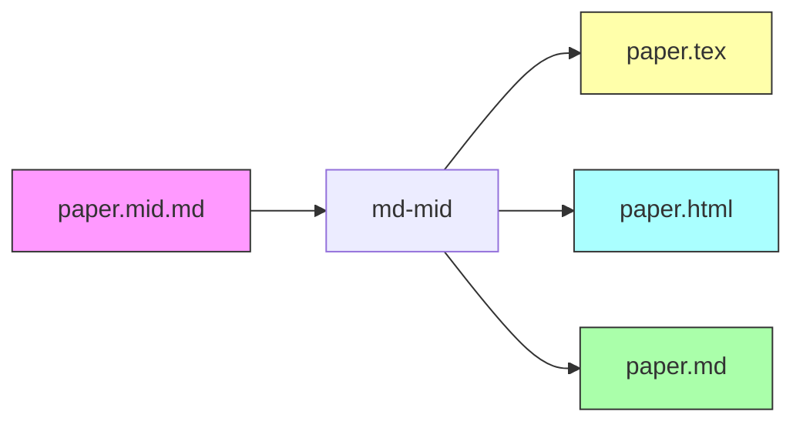
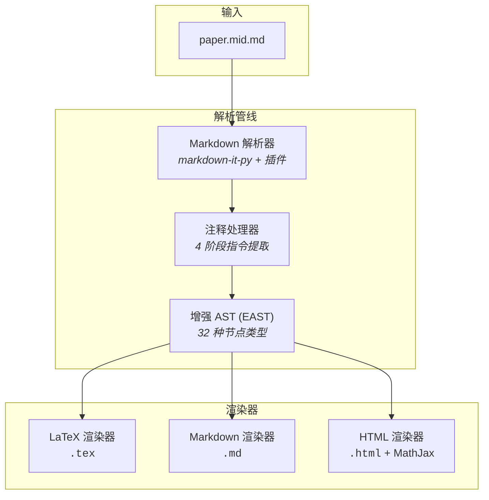
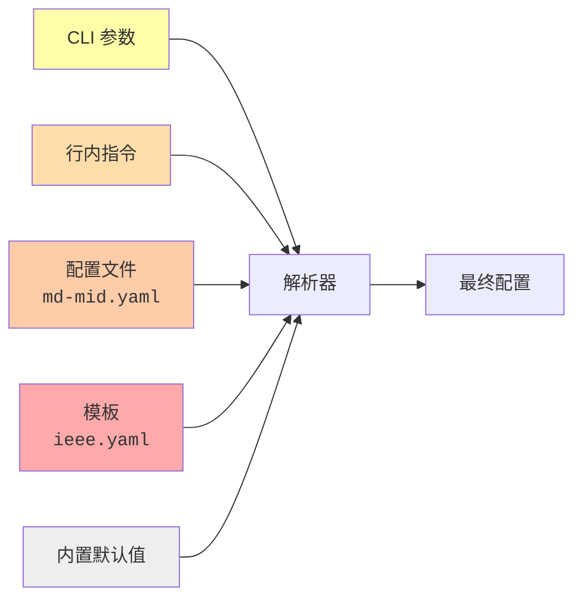
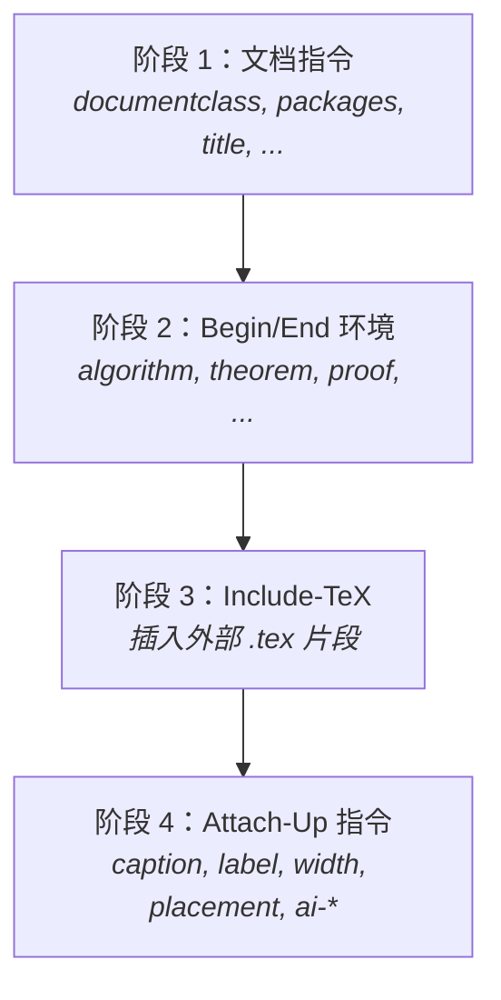

# md-mid

[](https://www.python.org/)
[](LICENSE)
[](tests/)
[](https://mypy-lang.org/)
[](https://docs.astral.sh/ruff/)
[](https://docs.astral.sh/uv/)

中文 · **[English](README.md)**

---

**学术写作中间格式与多目标转换工具**

md-mid 定义了一种基于 Markdown 的学术写作中间格式（`.mid.md`）。用纯 Markdown 编写
论文，通过 HTML 注释携带元数据，一次编写即可转换为 **LaTeX**、**富 Markdown** 或
**自包含 HTML** — 全部来自同一份源文件。



## 功能特性

- **多目标输出** — LaTeX (`.tex`)、富 Markdown (`.md`) 和带 MathJax 的 HTML
- **8 种引用命令** — `cite`、`citep`、`citet`、`citeauthor`、`citeyear`、`textcite`、
  `parencite`、`autocite`，支持 BibTeX 文件解析
- **数学公式** — 行内 `$...$` 与行间 `$$...$$`，支持标签和方程环境
- **交叉引用** — 标签和引用在不同目标中自动转换为 `\ref{}` / `<a href>` / `{#id}`
- **图表** — 通过 HTML 注释指令设置 caption、label、width、placement
- **环境块** — `<!-- begin: algorithm -->` / `<!-- end: algorithm -->`
- **TeX 嵌入** — `<!-- include-tex: fragment.tex -->` 引入外部 LaTeX 片段
- **AI 图片生成** — 可选的 nanobanana 兼容 runner 图片生成管线
- **5 层配置** — CLI > 行内指令 > 配置文件 > 模板 > 默认值
- **国际化** — 支持 `zh`（中文）和 `en`（英文）图表标签

## 架构



每个渲染器支持三种输出模式：

| 模式 | LaTeX | Markdown | HTML |
|------|-------|----------|------|
| `full` | 导言区 + `\begin{document}` + 参考文献 | YAML front matter + 正文 + 脚注 | `<!DOCTYPE html>` + CSS + MathJax CDN |
| `body` | `\begin{document}...\end{document}` 内部 | 正文 + 脚注（无 front matter） | `<body>` 内容 |
| `fragment` | 裸内容，标题降级一级 | 裸内容 | 裸内容 |

<details>
<summary><b>EAST 节点类型（共 32 种）</b></summary>

**块级节点 (16)：**
`Document` · `Heading` · `Paragraph` · `Blockquote` · `List` · `ListItem` · `CodeBlock` ·
`MathBlock` · `Figure` · `Table` · `Environment` · `RawBlock` · `ThematicBreak` ·
`FootnoteDef` · `HardBreak` · `SoftBreak`

**行内节点 (16)：**
`Text` · `Strong` · `Emphasis` · `CodeInline` · `MathInline` · `Link` · `Image` ·
`Citation` · `CrossRef` · `FootnoteRef` · `FootnoteDef` · `SoftBreak` · `HardBreak` ·
`RawInline` · `Strikethrough` · `Superscript`

所有节点继承 `Node` 基类，拥有 `children`、`metadata` 和 `position` 字段。

</details>

## 快速开始

### 前置条件

- **Python 3.14+**
- [**uv**](https://docs.astral.sh/uv/) 包管理器

### 安装

```bash
git clone https://github.com/<owner>/academic-md2latex.git
cd academic-md2latex
uv sync
```

### 基本用法

```bash
# Markdown → LaTeX（默认）
md-mid paper.mid.md -o paper.tex

# 显式 convert 子命令（与上一行等价）
md-mid convert paper.mid.md -o paper.tex

# Markdown → HTML（带 MathJax）
md-mid paper.mid.md -o paper.html -t html

# Markdown → 富 Markdown
md-mid paper.mid.md -o paper.md -t markdown

# 验证引用、交叉引用和图片
md-mid validate paper.mid.md --bib refs.bib --strict

# 检查格式化状态（未格式化时退出码 1）
md-mid format paper.mid.md --check --diff

# 从标准输入读取，仅正文模式
cat paper.mid.md | md-mid - --mode body -o paper.tex

# 导出增强 AST 用于调试
md-mid paper.mid.md --dump-east | jq .
```

<details>
<summary><b>完整 CLI 参考</b></summary>

md-mid 使用子命令：`convert`（默认）、`validate` 和 `format`。
`convert` 子命令是隐式的 —— `md-mid file.mid.md` 等同于 `md-mid convert file.mid.md`。

```
用法: md-mid [OPTIONS] COMMAND [ARGS]...

子命令:
  convert   转换学术 Markdown 为 LaTeX/Markdown/HTML（默认）
  validate  验证引用、交叉引用和图片完整性
  format    规范化学术 Markdown 格式
```

**convert**（默认）:
```
用法: md-mid convert [OPTIONS] INPUT

选项:
  -o, --output PATH                   输出文件（省略则输出到 stdout）
  -t, --target [latex|markdown|html]  输出格式（默认: latex）
  --mode [full|body|fragment]         输出范围（默认: full）
  --config PATH                       配置文件（md-mid.yaml）
  --template PATH                     LaTeX 模板（.yaml）
  --bib PATH                          参考文献文件（.bib）
  --bibliography-mode MODE            auto | standalone | external | none
  --heading-id-style [attr|html]      标题锚点格式
  --locale [zh|en]                    标签语言（默认: zh）
  --generate-figures                  启用 AI 图片生成
  --figures-runner PATH               图片生成 runner 脚本
  --figures-config PATH               runner 配置（TOML）
  --force-regenerate                  强制重新生成已有图片
  --strict                            严格解析模式
  --verbose                           详细输出
  --dump-east                         导出增强 AST 为 JSON
```

**validate**:
```
用法: md-mid validate [OPTIONS] INPUT

选项:
  --bib PATH       用于验证引用的 BibTeX 文件
  --config PATH    外部配置文件（md-mid.yaml）
  --template PATH  LaTeX 模板文件（.yaml）
  --strict         有警告时以退出码 1 退出
  --verbose        显示全部诊断信息
```

**format**:
```
用法: md-mid format [OPTIONS] INPUT

选项:
  -o, --output PATH  输出路径（默认: 覆盖输入文件）
  --check            仅检查，未格式化时退出码 1
  --diff             显示统一差异
```

</details>

## Python API

md-mid 提供了简洁的 Python API，可在构建系统、Jupyter notebook、Web 服务和自定义工具中
程序化使用。所有公共符号均可直接从 `md_mid` 包导入。

```python
from md_mid import convert, validate_text, format_text, parse_document
from md_mid import ConvertResult, ConversionError, MdMidConfig, Diagnostic, Document
```

### `convert()` — 转换学术 Markdown

主要入口函数。将 Markdown 源文件转换为 LaTeX、HTML 或富 Markdown。

```python
from md_mid import convert

# 基本用法：字符串 → LaTeX
result = convert("# 绪论\n\n你好世界。\n")
print(result.text)       # \documentclass[12pt,a4paper]{article} ...
print(result.config)     # MdMidConfig(target='latex', mode='full', ...)
print(result.document)   # Document(children=[Heading(...), Paragraph(...)])
print(result.diagnostics)  # []（无警告/错误时为空列表）
```

**参数：**

| 参数 | 类型 | 默认值 | 说明 |
|------|------|--------|------|
| `source` | `str \| Path` | *必填* | Markdown 文本字符串或文件路径 |
| `target` | `str` | `"latex"` | 输出格式：`"latex"` / `"markdown"` / `"html"` |
| `mode` | `str \| None` | `None` | 输出范围：`"full"` / `"body"` / `"fragment"` |
| `locale` | `str \| None` | `None` | 标签语言：`"zh"` / `"en"` |
| `config` | `MdMidConfig \| dict \| None` | `None` | 预构建配置对象或覆盖字典 |
| `template` | `Path \| None` | `None` | 模板 YAML 文件路径 |
| `bib` | `Path \| str \| dict \| None` | `None` | `.bib` 文件路径、原始文本或预解析字典 |
| `strict` | `bool` | `False` | 有诊断错误时抛出 `ConversionError` |

**返回：** `ConvertResult` — 冻结 dataclass，含 `.text`、`.diagnostics`、`.config`、`.document` 属性。

#### 输出目标

```python
# LaTeX（默认）
latex_result = convert(source)

# 富 Markdown，带 BibTeX 脚注
md_result = convert(source, target="markdown", bib=Path("refs.bib"))

# 自包含 HTML，带 MathJax
html_result = convert(source, target="html")
```

#### 输出模式

```python
# 完整文档，含导言区（默认）
full = convert(source, mode="full")

# 仅正文 — 无 \documentclass 或 \begin{document}
body = convert(source, mode="body")

# 片段 — 裸内容，标题降级
fragment = convert(source, mode="fragment")
```

#### 文件路径输入

```python
from pathlib import Path

# 直接从 .mid.md 文件读取
result = convert(Path("paper.mid.md"), target="html")
```

#### 配置

三种传入配置的方式：

```python
from md_mid import convert, MdMidConfig
from pathlib import Path

# 1. 字典覆盖 — 与默认值合并
result = convert(source, config={
    "documentclass": "report",
    "classoptions": ["11pt", "letterpaper"],
    "locale": "en",
})

# 2. 预构建 MdMidConfig — 直接使用，不合并
cfg = MdMidConfig(mode="body", locale="en", documentclass="IEEEtran")
result = convert(source, config=cfg)

# 3. 模板 YAML 文件 — 在模板层合并
result = convert(source, template=Path("templates/ieee.yaml"))
```

#### 参考文献

三种提供参考文献数据的方式：

```python
from pathlib import Path

# .bib 文件路径
result = convert(md, target="markdown", bib=Path("refs.bib"))

# 原始 .bib 文本内容
bib_text = '@article{wang2024, author={Wang}, title={Test}, year={2024}}'
result = convert(md, target="markdown", bib=bib_text)

# 预解析字典（引用键 → 显示字符串）
result = convert(md, target="markdown", bib={"wang2024": "Wang. Test. 2024."})
```

#### 严格模式

```python
from md_mid import convert, ConversionError

try:
    result = convert(source, strict=True)
except ConversionError as e:
    print(f"转换失败: {e}")
    for diag in e.diagnostics:
        print(f"  {diag}")
```

### `validate_text()` — 验证文档

运行 EAST 遍历器和验证器，检查引用、交叉引用等。返回 `Diagnostic` 对象列表。

```python
from md_mid import validate_text

# 基本验证
diagnostics = validate_text("参见 [ref](cite:missing_key)。\n", bib={})
for d in diagnostics:
    print(d)  # [WARNING] <string> - Citation key 'missing_key' not found ...

# 使用 .bib 文件
diagnostics = validate_text(Path("paper.mid.md"), bib=Path("refs.bib"))

# 严格模式 — 有错误时抛出 ConversionError
from md_mid import ConversionError
try:
    validate_text(source, strict=True)
except ConversionError as e:
    print(f"验证失败，共 {len(e.diagnostics)} 个问题")
```

### `format_text()` — 规范化格式

往返规范化：解析 → 重新渲染为 Markdown。幂等操作 — 对已格式化的文档再次
格式化会返回相同文本。

```python
from md_mid import format_text

formatted = format_text("# 你好\n\n世界。\n")
print(formatted)

# 也支持文件路径
formatted = format_text(Path("paper.mid.md"))

# 幂等性检查
assert format_text(formatted) == formatted
```

### `parse_document()` — 低级 EAST 访问

返回原始 EAST `Document` 树，用于自定义处理。运行解析 + 注释指令处理，
但不执行渲染。

```python
from md_mid import parse_document, Document
from md_mid.nodes import Heading, Paragraph

doc = parse_document("# 你好\n\n世界。\n")
assert isinstance(doc, Document)

# 检查树结构
for child in doc.children:
    print(f"{child.type}: {child}")

# 访问文档级指令元数据
doc = parse_document("""
<!-- title: 我的论文 -->
<!-- author: 作者 -->

# 绪论
""")
print(doc.metadata)  # {'title': '我的论文', 'author': '作者'}
```

### `ConvertResult` — 结果对象

```python
@dataclass(frozen=True)
class ConvertResult:
    text: str                    # 渲染后的输出字符串
    diagnostics: list[Diagnostic]  # 警告和错误
    config: MdMidConfig          # 解析后的配置
    document: Document           # EAST 树（用于检查）
```

### `ConversionError` — 错误类型

当 `strict=True` 且诊断信息包含错误时抛出。

```python
class ConversionError(Exception):
    diagnostics: list[Diagnostic]  # 所有诊断信息
```

### 集成示例

<details>
<summary><b>Jupyter Notebook</b></summary>

```python
from md_mid import convert
from IPython.display import HTML

source = Path("paper.mid.md").read_text()
result = convert(source, target="html", mode="body")
HTML(result.text)
```

</details>

<details>
<summary><b>构建系统（Makefile / 脚本）</b></summary>

```python
#!/usr/bin/env python3
"""批量转换所有 .mid.md 文件为 LaTeX。"""
from pathlib import Path
from md_mid import convert

for md_file in Path("chapters/").glob("*.mid.md"):
    result = convert(md_file, template=Path("templates/ieee.yaml"))
    out = md_file.with_suffix(".tex")
    out.write_text(result.text, encoding="utf-8")
    print(f"{md_file} → {out}（{len(result.diagnostics)} 条诊断）")
```

</details>

<details>
<summary><b>Web 服务（FastAPI）</b></summary>

```python
from fastapi import FastAPI, HTTPException
from md_mid import convert, ConversionError

app = FastAPI()

@app.post("/convert")
def convert_markdown(source: str, target: str = "latex"):
    try:
        result = convert(source, target=target, strict=True)
        return {"text": result.text, "diagnostics": [str(d) for d in result.diagnostics]}
    except ConversionError as e:
        raise HTTPException(400, detail=[str(d) for d in e.diagnostics])
```

</details>

<details>
<summary><b>自定义 EAST 处理</b></summary>

```python
from md_mid import parse_document
from md_mid.nodes import Heading, Citation

doc = parse_document(Path("paper.mid.md"))

# 提取所有标题
headings = [
    (child.level, child)
    for child in doc.children
    if isinstance(child, Heading)
]

# 收集所有引用键
def collect_cites(node, keys=None):
    if keys is None:
        keys = set()
    if isinstance(node, Citation):
        keys.update(node.keys)
    for child in node.children:
        collect_cites(child, keys)
    return keys

all_keys = collect_cites(doc)
print(f"共找到 {len(all_keys)} 个唯一引用键")
```

</details>

## 文档格式

md-mid 文档是标准 Markdown 文件，扩展名为 `.mid.md`。所有学术元数据通过
**HTML 注释**（`<!-- key: value -->`）编码，因此源文件在任何 Markdown 阅读器中
都完全可读，同时携带完整的 LaTeX 语义。

### 文档级指令

写在 `.mid.md` 文件顶部，控制 LaTeX 导言区：

```markdown
<!-- documentclass: article -->
<!-- classoptions: [12pt, a4paper] -->
<!-- packages: [amsmath, graphicx, hyperref] -->
<!-- bibliography: refs.bib -->
<!-- bibstyle: IEEEtran -->
<!-- title: 基于 FPGA 的实时点云配准方法 -->
<!-- author: 作者姓名 -->
<!-- date: 2026 -->
<!-- abstract: |
  本文提出了一种基于 FPGA 的实时点云配准方法……
-->
```

<details>
<summary><b>生成的 LaTeX 导言区</b></summary>

```latex
\documentclass[12pt,a4paper]{article}
\usepackage{amsmath}
\usepackage{graphicx}
\usepackage{hyperref}
\bibliographystyle{IEEEtran}
\title{基于 FPGA 的实时点云配准方法}
\author{作者姓名}
\date{2026}

\begin{document}
\maketitle

\begin{abstract}
本文提出了一种基于 FPGA 的实时点云配准方法……
\end{abstract}

% ... 正文内容 ...

\bibliography{refs}

\end{document}
```

</details>

### 引用

使用 Markdown 链接语法，URL 中带 `cite:` 前缀：

```markdown
先前的工作 [Wang et al.](cite:wang2024) 表明……
经典方法 [1](citep:fischler1981) 存在局限性。
如 [Smith](citeauthor:smith2023) 所述……
```

| md-mid 语法 | LaTeX 输出 | HTML 输出 |
|-------------|-----------|-----------|
| `[text](cite:key)` | `\cite{key}` | `<sup><a href="#cite-key">[1]</a></sup>` |
| `[text](citep:key)` | `\citep{key}` | `<sup><a href="#cite-key">[1]</a></sup>` |
| `[text](citet:key)` | `\citet{key}` | `<sup><a href="#cite-key">[1]</a></sup>` |
| `[text](citeauthor:key)` | `\citeauthor{key}` | `<sup><a href="#cite-key">[1]</a></sup>` |
| `[text](citeyear:key)` | `\citeyear{key}` | `<sup><a href="#cite-key">[1]</a></sup>` |
| `[text](textcite:key)` | `\textcite{key}` | `<sup><a href="#cite-key">[1]</a></sup>` |
| `[text](parencite:key)` | `\parencite{key}` | `<sup><a href="#cite-key">[1]</a></sup>` |
| `[text](autocite:key)` | `\autocite{key}` | `<sup><a href="#cite-key">[1]</a></sup>` |

### 交叉引用

```markdown
# 绪论
<!-- label: sec:intro -->

详见 [第1节](ref:sec:intro)。
```

| 目标 | 输出 |
|------|------|
| LaTeX | `\label{sec:intro}` + `\ref{sec:intro}` |
| HTML | `<h1 id="sec:intro">` + `<a href="#sec:intro">` |
| Markdown | `{#sec:intro}` + `<a href="#sec:intro">` |

### 带元数据的图片

```markdown

<!-- caption: 点云配准方法分类 -->
<!-- label: fig:pipeline -->
<!-- width: 0.85\textwidth -->
<!-- placement: htbp -->
```

<details>
<summary><b>生成的 LaTeX 图片环境</b></summary>

```latex
\begin{figure}[htbp]
\centering
\includegraphics[width=0.85\textwidth]{figures/pipeline.png}
\caption{点云配准方法分类}
\label{fig:pipeline}
\end{figure}
```

</details>

<details>
<summary><b>生成的 HTML 图片</b></summary>

```html
<figure id="fig:pipeline">
  
  <figcaption>图 1: 点云配准方法分类</figcaption>
</figure>
```

</details>

<details>
<summary><b>生成的富 Markdown 图片</b></summary>

```html
<figure id="fig:pipeline">
  
  <figcaption><strong>图 1</strong>: 点云配准方法分类</figcaption>
</figure>
```

</details>

### AI 生成图片

标记图片为 AI 生成，在输出中包含溯源元数据：

```markdown

<!-- caption: 方法分类 -->
<!-- label: fig:taxonomy -->
<!-- ai-generated: true -->
<!-- ai-model: dall-e-3 -->
<!-- ai-prompt: |
  学术风格的方法分类图，
  简洁干净，白底蓝色点缀
-->
<!-- ai-negative-prompt: 写实风格, 3D渲染 -->
```

在 LaTeX 输出中，AI 元数据变为 `%` 注释；在 HTML 和富 Markdown 中，渲染为可折叠的
`<details>` 块。

使用 `--generate-figures` 从提示词自动生成图片：

```bash
md-mid paper.mid.md -o paper.tex \
  --generate-figures \
  --figures-runner ./runner.py \
  --figures-config api.toml
```

### 表格

```markdown
| 方法   | RMSE (cm) | 时间 (ms) | 平台   |
|--------|-----------|-----------|--------|
| RANSAC | 2.3       | 150       | CPU    |
| 本文   | 1.9       | 8         | FPGA   |
<!-- caption: ModelNet40 数据集性能对比 -->
<!-- label: tab:results -->
```

<details>
<summary><b>生成的 LaTeX 表格</b></summary>

```latex
\begin{table}[htbp]
\centering
\caption{ModelNet40 数据集性能对比}
\label{tab:results}
\begin{tabular}{llll}
\hline
方法 & RMSE (cm) & 时间 (ms) & 平台 \\
\hline
RANSAC & 2.3 & 150 & CPU \\
本文 & 1.9 & 8 & FPGA \\
\hline
\end{tabular}
\end{table}
```

</details>

### 数学公式

```markdown
行内公式：变换 $T \in SE(3)$ 定义为……

行间公式带标签：

$$
T = \begin{bmatrix} R & t \\ 0 & 1 \end{bmatrix}
$$
<!-- label: eq:transform -->
```

| 目标 | 行内 | 行间 |
|------|------|------|
| LaTeX | `$T \in SE(3)$` | `\begin{equation} ... \label{eq:transform} \end{equation}` |
| HTML | `$T \in SE(3)$` (MathJax) | `\[ ... \]`，带 `id="eq:transform"` |
| Markdown | `$T \in SE(3)$` | `$$ ... $$`，带 `<a id="eq:transform">` |

### 环境块

```markdown
<!-- begin: algorithm -->
**输入：** 点云 $P$ 和 $Q$

1. 计算共面基
2. 寻找全等集
3. 验证与精炼

**输出：** 刚体变换 $T$
<!-- end: algorithm -->
```

<details>
<summary><b>生成的 LaTeX 环境</b></summary>

```latex
\begin{algorithm}
\textbf{输入：} 点云 $P$ 和 $Q$

\begin{enumerate}
\item 计算共面基
\item 寻找全等集
\item 验证与精炼
\end{enumerate}

\textbf{输出：} 刚体变换 $T$
\end{algorithm}
```

</details>

### TeX 嵌入

插入外部 LaTeX 片段（如复杂的 TikZ 图）：

```markdown
<!-- include-tex: figures/architecture.tex -->
```

读取文件内容并作为 `RawBlock` 节点插入，支持在环境块内递归使用。

### 完整示例

参见 [`tests/fixtures/full_example.mid.md`](tests/fixtures/full_example.mid.md)，
展示了所有功能的完整用例。

## 配置



优先级：**CLI > 行内指令 > 配置文件 > 模板 > 默认值**。高层覆盖低层。这让你可以在
模板中设置投稿目标默认值，在配置文件中按论文覆盖，在命令行中按次构建微调。

### 配置文件（`md-mid.yaml`）

```yaml
documentclass: article
classoptions: [12pt, a4paper]
packages: [amsmath, graphicx]
code_style: lstlisting       # 或: minted
locale: zh                    # 或: en
target: latex                 # 或: markdown, html
bibliography_mode: auto       # 或: standalone, external, none
heading_id_style: attr        # 或: html
extra-preamble: |
  \DeclareMathOperator{\argmin}{argmin}
```

<details>
<summary><b>全部配置字段</b></summary>

| 字段 | 类型 | 默认值 | 说明 |
|------|------|--------|------|
| `documentclass` | `str` | `"article"` | LaTeX 文档类 |
| `classoptions` | `list[str]` | `[]` | 类选项，如 `12pt`、`a4paper` |
| `packages` | `list[str]` | `[]` | 要加载的 LaTeX 包 |
| `title` | `str` | `""` | 文档标题 |
| `author` | `str` | `""` | 作者 |
| `date` | `str` | `""` | 日期 |
| `abstract` | `str` | `""` | 摘要文本 |
| `bibliography` | `str` | `""` | BibTeX 文件路径 |
| `bibstyle` | `str` | `"plain"` | 参考文献样式 |
| `code_style` | `str` | `"lstlisting"` | 代码块渲染样式 |
| `locale` | `str` | `"zh"` | 标签语言 |
| `target` | `str` | `"latex"` | 默认输出目标 |
| `bibliography_mode` | `str` | `"auto"` | 参考文献输出策略 |
| `heading_id_style` | `str` | `"attr"` | 标题锚点格式 |
| `extra-preamble` | `str` | `""` | 导言区原始 LaTeX |
| `thematic_break_style` | `str` | `"newpage"` | `newpage` / `hrule` / `ignore` |
| `tilde_ref` | `bool` | `true` | 使用 `~\ref` 代替 `\ref` |

</details>

### 模板文件

模板为特定投稿目标提供可复用的默认配置。示例 — IEEE 会议：

```yaml
# templates/ieee.yaml
documentclass: IEEEtran
classoptions: [conference]
packages:
  - amsmath
  - graphicx
  - cite
extra-preamble: |
  \IEEEoverridecommandlockouts
bibstyle: IEEEtran
```

```bash
md-mid paper.mid.md --template templates/ieee.yaml -o paper.tex
```

## 项目结构

```
academic-md2latex/
├── src/md_mid/              # 源代码（17 个模块）
│   ├── __init__.py          #   公共 API 重导出
│   ├── api.py               #   公共 Python API（convert、validate、format）
│   ├── cli.py               #   Click CLI 入口
│   ├── parser.py            #   Markdown → EAST 解析器
│   ├── nodes.py             #   EAST 节点定义（32 种类型）
│   ├── comment.py           #   4 阶段注释指令处理器
│   ├── config.py            #   5 层配置解析
│   ├── latex.py             #   LaTeX 渲染器
│   ├── markdown.py          #   富 Markdown 渲染器（2 遍扫描）
│   ├── html.py              #   HTML 渲染器（MathJax CDN）
│   ├── bibtex.py            #   最小化 BibTeX 解析器
│   ├── genfig.py            #   AI 图片生成管线
│   ├── escape.py            #   LaTeX 特殊字符转义
│   ├── sanitize.py          #   HTML 输入清洗
│   ├── url_check.py         #   URL 安全验证
│   ├── ai_meta.py           #   共享 AI 元数据渲染
│   └── diagnostic.py        #   错误/警告诊断
├── tests/                   # 测试套件（17 个文件，474 个测试）
│   ├── fixtures/            #   测试用 .mid.md 文档
│   └── conftest.py          #   共享 pytest fixtures
├── templates/               # LaTeX 投稿模板 (ieee.yaml, ...)
├── docs/                    # 文档与计划
├── pyproject.toml           # 项目元数据和工具配置
├── Makefile                 # 构建命令
└── CLAUDE.md                # AI 代理编码规范
```

<details>
<summary><b>注释处理器 4 阶段管线</b></summary>



- **阶段 1** 提取顶层元数据（documentclass、packages、title、author 等）
- **阶段 2** 将 `<!-- begin: X -->` / `<!-- end: X -->` 配对为 `Environment` 节点
- **阶段 3** 将 `<!-- include-tex: file.tex -->` 替换为 `RawBlock` 内容（支持递归）
- **阶段 4** 将尾随注释元数据附加到前面的 figure/table/math 节点

</details>

## 开发

### 环境搭建

```bash
uv sync                      # 安装所有依赖
```

### 命令

| 命令 | 说明 |
|------|------|
| `make check` | 运行 lint + 类型检查 + 测试 **（提交前必须执行）** |
| `make test` | 运行 pytest（详细输出） |
| `make lint` | 运行 ruff 检查 |
| `make format` | 运行 ruff 格式化 |
| `make typecheck` | 运行 mypy（严格模式） |
| `make fix` | 自动修复 lint 问题并格式化 |

### 编码规范

| 规则 | 示例 |
|------|------|
| 所有函数必须有类型注解 | `def parse(text: str) -> Document:` |
| 双语注释（英文 + 中文） | `# Calculate average (计算平均值)` |
| Google 风格双语文档字符串 | 参见 [CLAUDE.md](CLAUDE.md) |
| 行长最大 100 字符 | 由 ruff 强制执行 |
| 函数 `snake_case`，类 `PascalCase` | `render_figure()`、`LaTeXRenderer` |

<details>
<summary><b>文档字符串示例</b></summary>

```python
def render_figure(self, node: Node) -> str:
    """Render a Figure node as LaTeX figure environment.

    将 Figure 节点渲染为 LaTeX figure 环境。

    Args:
        node: Figure node to render (待渲染的 Figure 节点)

    Returns:
        LaTeX figure environment string (LaTeX figure 环境字符串)
    """
```

</details>

### 测试

测试文件与源代码模块一一对应（`parser.py` → `test_parser.py`）。

```bash
make test                    # 运行全部 474 个测试
```

| 测试文件 | 覆盖内容 |
|----------|----------|
| `test_api.py` | 公共 Python API（convert、validate、format、parse） |
| `test_parser.py` | Markdown 解析、节点创建 |
| `test_nodes.py` | EAST 序列化、类型属性 |
| `test_latex.py` | LaTeX 渲染（标题、公式、引用、表格、图片） |
| `test_markdown.py` | 富 Markdown 渲染、索引遍 |
| `test_html.py` | HTML 渲染、清洗、MathJax |
| `test_comment.py` | 4 阶段注释指令处理 |
| `test_config.py` | 配置加载、优先级、验证 |
| `test_cli.py` | CLI 选项、错误处理 |
| `test_e2e.py` | 端到端转换管线 |
| `test_bibtex.py` | BibTeX 文件解析 |
| `test_genfig.py` | AI 图片生成任务 |
| `test_escape.py` | LaTeX 特殊字符转义 |
| `test_sanitize.py` | HTML 输入清洗 |
| `test_url_check.py` | URL 安全验证 |
| `test_diagnostic.py` | 诊断错误/警告收集 |

测试夹具在 [`tests/fixtures/`](tests/fixtures/) 下提供可复用的 `.mid.md` 文档：
`minimal`、`heading_para`、`math`、`cite_ref`、`comments`、`full_example`。

## 贡献指南

1. Fork 本仓库
2. 创建功能分支
3. 先写测试（推荐 TDD）
4. 确保 `make check` 通过（ruff、mypy、pytest）
5. 提交 Pull Request

所有代码必须包含完整的类型注解和双语（英文 + 中文）注释。
详见 [CLAUDE.md](CLAUDE.md) 完整编码规范。
